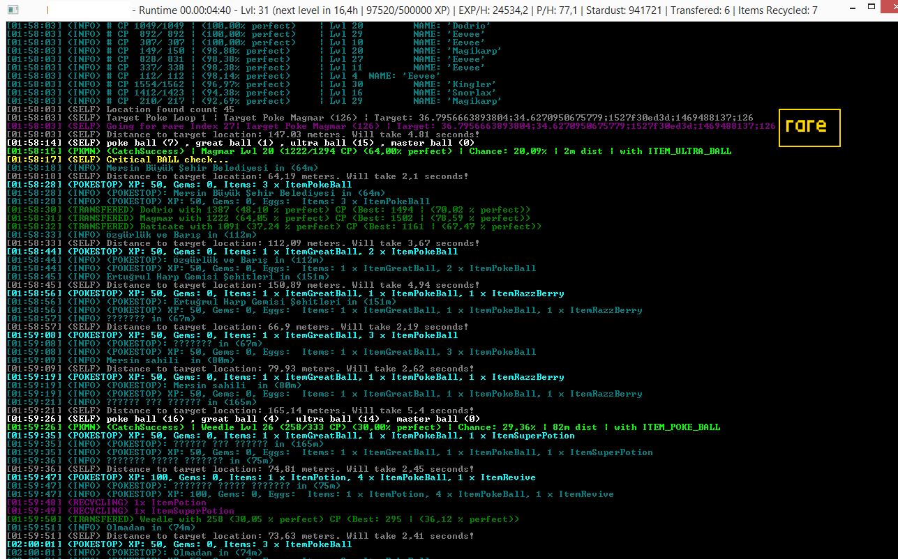

# Original fork [read description and FAQ there!] : https://github.com/NecronomiconCoding/NecroBot
# Lvl 26+ Pokemon GO Accounts Giveaway Events: http://www.monstermmorpg.com/Pokemon-GO-Giveaways 
# www.pokemonpets.com free Pokemon MMO RPG
# www.monstermmorpg.com free Monster MMO RPG

## Features? 
- More advanced Pokemon hunting by Poke Miner
- Rare Pokemon priority hunting by Poke Miner
- Auto switch between Pokemon hunting and PokeStop farming according to Poke Ball count
- Full scale account details logging. The details file is saved in the folder where you run your console.exe
- Perfectly stable can run over 24 hours

## Why separate project?
- I started as a separate project since i am still a total noob of GitHub code management system
- I have never collaborated previously with any other developers. Thus, I have to improve my skills
- In future this project may discontinue if the all features here get added to Original Project

## How to use?

Set your location around a place where there are PokeStops. I suggest you to farm in your city.

You need to install Poke Miner if you want to use Pokemon Farming + Rare Pokemon Farming features

Poke Miner on reddit for more info : https://www.reddit.com/r/pokemongodev/comments/4tz66s/pokeminer_your_individual_pokemon_locations/

Poke Miner github : https://github.com/modrzew/pokeminer

Once you setup your pokeminer, start agents around the location you will start farming your bot

In our application you have set the location of your Poke Miner db

In order to do so go to <b>Logic.cs</b> and find the function <b>funcReturnPokeLoc</b>

In this funtion you will see <b>new SQLiteConnection(@"Data Source=C:\Python27\db.sqlite;Version=3;");</b>

Modify the Poke Miner db location as you wish

For rare Pokemon Hunting list go to <b>Client.cs</b> and find the list <b>lstPriorityPokemon</b>

Modify the rare Pokemon IDs as you wish

It has a priority so put your most wanted pokemon into the beginning of the list

Feel free to ask any questions with opening issues

Thank you for reading

## Don't forget to set pre-defined PokeStops locations and your starting location
- If the bot can not find any nearby Pokestop, it moves to next pre-defined Poke Stop location
- You can modify the locations inside <b>Client.cs</b>
- The pre configured list name is <b>lstPokeStopLocations</b>
- I suggest putting different poke stop locations in a close range area like 5 km radius or 10
- Do not worry, it will not jump but walk to the next location with the speed you have defined in your app settings
- Start location file is saved in <b>App.config</b> under <b>RocketAPI.Console project</b>

## What is lack?
- Still cannot incubate eggs

### Screenshot from the best giveaway account farming :)

